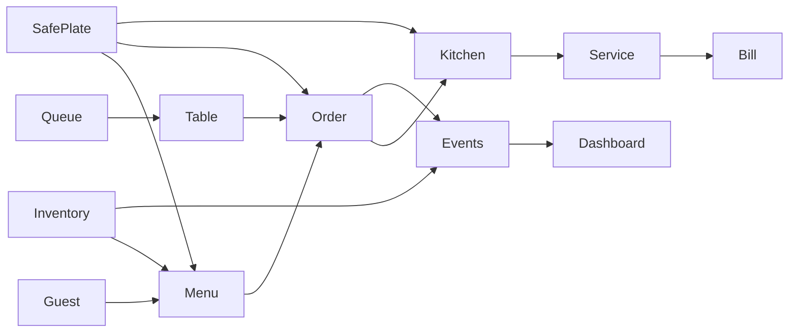

# Restaurant Pulse

Restaurant Pulse is a real-time restaurant operating system connecting guests, tables, service, kitchen, inventory, billing and operational analytics. Its differentiator, **SafePlate Relay**, preserves dietary context through every handoff and fails safely when ingredient information is incomplete.

> SafePlate supports communication and operational decisions. It cannot guarantee the absence of allergens or cross-contact.

## Hackathon coverage

- **Bronze:** premium responsive customer and staff interfaces
- **Silver:** Auth.js credentials/Google integration, digital menu, live availability, queue, orders and notifications
- **Gold:** role-specific kitchen/service/manager workspaces, inventory, billing and analytics
- **Platinum:** explainable constraint classification, ingredient impact propagation, estimates and recommendations

## Architecture



The Next.js App Router application uses server components by default and a focused client operations shell for the live demo. Mongoose models live in `lib/models.ts`; business rules such as dietary classification, billing, estimates and order transitions live in `lib/domain.ts`. Auth.js provides JWT sessions with credentials and optional Google OAuth.

## Local setup

Requirements: Node.js 22+, npm, and MongoDB 7+.

```bash
npm install
copy .env.example .env.local
npm run dev
```

Set `MONGODB_URI=mongodb://127.0.0.1:27017/restaurant-pulse` for a local database. Generate a strong secret with `openssl rand -base64 32` and set it as `AUTH_SECRET`.

## Commands

```bash
npm run dev
npm run typecheck
npm run lint
npm test
npm run build
npm run start
```

## OAuth and email

Create a Google OAuth web application and allow:

- `http://localhost:3000/api/auth/callback/google`
- `https://YOUR_DOMAIN/api/auth/callback/google`

Set `AUTH_GOOGLE_ID` and `AUTH_GOOGLE_SECRET`. Configure the SMTP variables for verification and password-reset delivery. Google login is omitted safely when its credentials are absent.

## Production deployment

1. Create a MongoDB Atlas database and restricted application user.
2. Add all `.env.example` values to the deployment environment.
3. Set `AUTH_URL` and `NEXT_PUBLIC_APP_URL` to the public HTTPS origin.
4. Configure the production Google callback.
5. Run `npm run build`.
6. Deploy to Vercel or another Node.js-compatible Next.js host.
7. Verify registration, role boundaries, queue, order, inventory and bill flows in an incognito browser.

## Demo

Use the role switcher in the header to present the seeded interactive demo:

1. **Guest:** select Soy, inspect explainable compatibility, join the queue and place an order.
2. **Kitchen:** acknowledge the order and expose its safety handoff.
3. **Manager:** show the sauce substitution alert and low stock.
4. **Service:** resolve the task, serve a ready order and close the loop.

## Security and limitations

The repository includes strict schemas, server-calculated money, idempotency keys, indexed restaurant scoping and deterministic SafePlate rules. External OAuth, SMTP, a running MongoDB instance and production deployment credentials must be configured by the operator. Payment collection is intentionally simulated; staff records a payment after collecting it through the restaurant's existing process.

## Submission checklist

- [ ] Team name added
- [ ] Public repository URL added
- [ ] Live application URL added
- [ ] MongoDB Atlas and OAuth configured
- [ ] Production demo data loaded
- [ ] Mobile and incognito smoke test completed
- [ ] Required presentation exported to PDF
- [ ] AI usage and safety limitations disclosed
